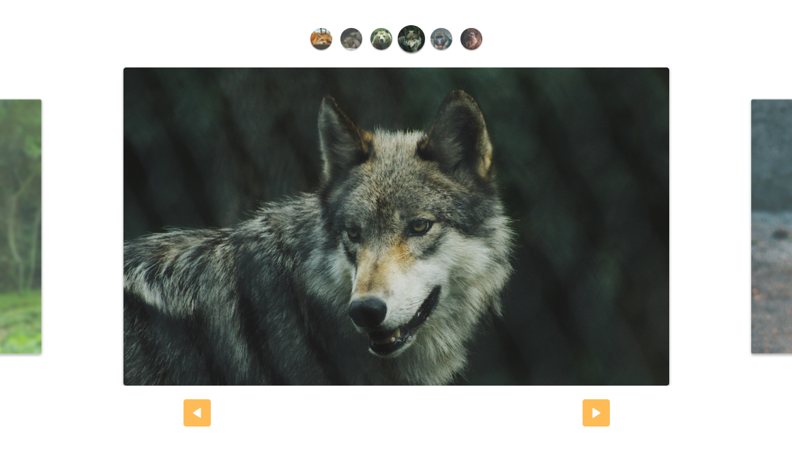

# Slide :flower_playing_cards:

Este projeto consiste em um slide responsivo desenvolvido utilizando JavaScript, CSS e HTML, sem a utilização de qualquer biblioteca externa. O slide oferece uma maneira simples e eficaz de exibir conteúdo de forma sequencia, com transições suaves entre os slides e suporte para diferentes tamanhos de tela, garantindo uma experiência consistente em dispositivos desktop e móveis.

Para visualizar clique aqui: [Slide](https://thiag-o.github.io/slide)

## :bookmark_tabs: Instruções

1. Clone este repositório em sua máquina local `git clone https://github.com/thiag-o/slide.git`.
2. Abra o arquivo `index.html` em seu navegador da web.
3. Navegue entre os slides utilizando os controles de navegação ou os indicadores visuais.

## :books: Tecnologias

## Licença

[MIT](https://choosealicense.com/licenses/mit/)
